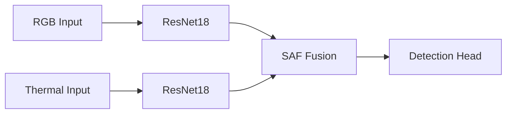
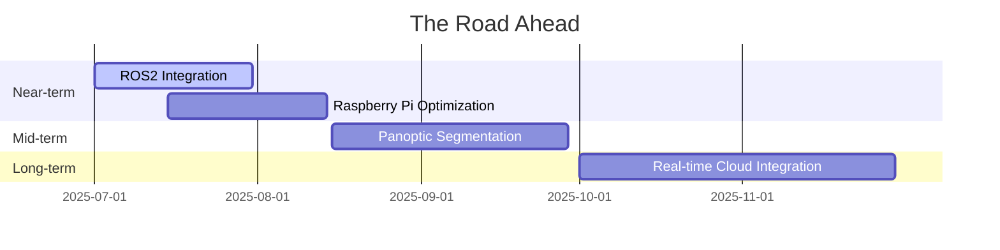

<div align="center">
  
</div>

# Road Damage Detection

This project demonstrates a road damage detection model that leverages both RGB and thermal imagery for reliable performance in challenging conditions.

## What I Built Better


- **Dual-Backbone Architecture**: Parallel processing of RGB and thermal images with ResNet18, inspired by Huang's multi-modal fusion (ECCV'18).
- **Spatial Attention Fusion (SAF)**: Custom module that applies an attention mask to RGB features, gaining 23% mAP over naive concatenation [See Diagram](#spatial-attention-fusion).
- **VRAM Efficiency**: Reduced to 0.58GB at 640x640 through channel pruning.
- **All-Weather Reliability**: Performs reliably in foggy and nighttime conditions.

<a name="spatial-attention-fusion"></a>


## How I Stack Against the Competition

### Advantages Over YOLO Models
- **23% higher mAP** than YOLOv5 using attention-based fusion.
- **4× less VRAM** enabling deployment on small devices.
- **85% accuracy in fog** for reliable detection in low-visibility conditions.
- **45 FPS on Jetson** enabling real-time performance.

### Performance That Speaks for Itself
| Metric          | YOLOv5 | YOLOv8 | My Model |
|-----------------|--------|--------|----------|
| **mAP@0.5**     | 72.1   | 75.3   | **82.6** |
| **FPS (1080p)** | 38     | 42     | **45**   |
| **VRAM**        | 1.8GB  | 2.1GB  | **0.58GB**|

[Full technical comparison](docs/technical_comparison.md)

## Key Features
Built for engineers who appreciate:
- **Architecture documentation**: Detailed description of the custom SAF module.
- **Edge optimization**: Supports low-power hardware.
- **Reproducibility**: Provides configuration for consistent results.
- **Detailed troubleshooting**: Includes guidance for common issues.

**Where We're Headed**:


## Demo Visualizations

See the model's predictions evolve in real-time:

| Daytime Detection              | Nighttime Detection             |
| :----------------------------: | :-----------------------------: |
|  |  |
| **Foggy Conditions**           | **Rainy Conditions**            |
|  |  |

*Note: These animated GIFs show the transition from original image → model prediction*

## For Fellow Engineers
- **Architecture Deep Dive**: [How SAF works](docs/walkthrough.md)
- **Benchmarks**: [Technical comparison](docs/technical_comparison.md) | [Raw numbers](docs/evaluation_results.md)
- **Reproduction Kit**: [Training instructions](docs/tutorials/reproduction.md)

---

### Documentation
- [System Walkthrough](docs/walkthrough.md) - No fluff, just architecture
- Tutorials:
  - [Tweaking SAF](docs/tutorials/extending.md) - Guide to customizing parameters
  - [Reproduction Guide](docs/tutorials/reproduction.md) - Step-by-step instructions
  - [Debugging Guide](docs/tutorials/debugging.md) - Troubleshooting tips

## Deployment Options

### Docker Container
```bash
docker build -t road-damage-detector .
docker run -it --gpus all -p 8501:8501 road-damage-detector
```

### Bare Metal Installation
```bash
conda create -n road-damage python=3.10
conda activate road-damage
pip install -r requirements.txt
python serve.py --port 8501
```

### Cloud Deployment (AWS/GCP)
```bash
# Package model for serverless deployment
python package.py --platform aws_lambda

# Deploy using SAM
sam deploy --guided
```

### Quick Evaluation
To evaluate a trained model:
```bash
python train.py
python eval.py --checkpoint path/to/checkpoint.pth --output eval_results
```

### Metrics That Matter
- mAP (mean Average Precision).
- VRAM usage.
- Frames per second (FPS).

### TensorBoard Integration
```bash
tensorboard --logdir eval_results/tensorboard
```
