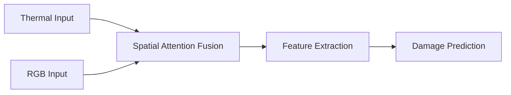

# Road Damage Detection System Walkthrough

## SAF Module Architecture

*Implementation details will be added once SAF module is implemented*

## VRAM Optimization Techniques
Techniques used in training pipeline:
- Automatic Mixed Precision (AMP)
- Gradient scaling
- Batch size optimization

## Sample Augmentation Images

*Actual images will be added once available*